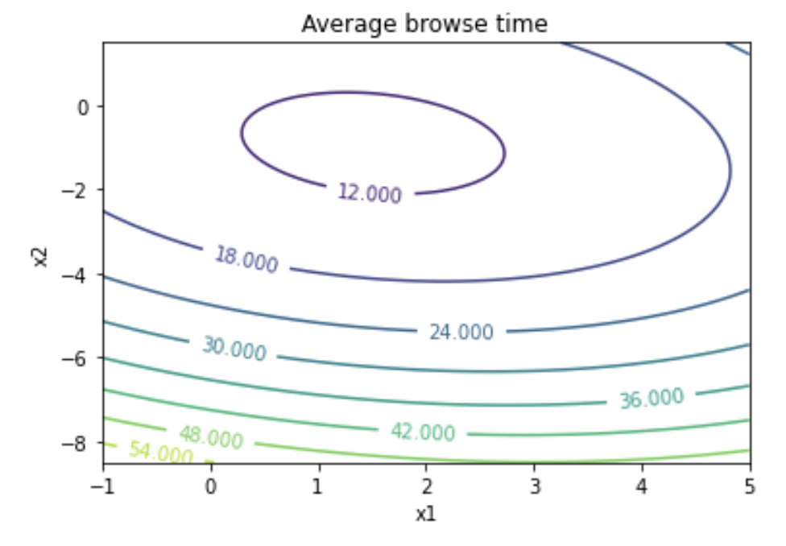

## Executive Summary

The project aims to optimize the average browsing time. We tested the four factors - Tile Size, Match Score, Preview Length, and Preview Type for their interaction and main effects. We carried out the factorial experiments including hypothesis tests on four-way, three-way and two-way interactions and finally the main effects, and followed by a response surface experiment to locate the optimal condition and corresponding response value, which is presented as follows:

optimal condition - `Preview Length` = 70, `Match Score` = 76, `Preview Type` = "Teaser/Trailer", `Tile Size` could be any number between 0.1 and 0.5

predicted browse time - 11.0770

95% prediction interval for browse time - [10.8160, 11.3380]

## Introduction

The interest of this problem lies into minimizing the user’s browsing time before clicking into any one of the recommended movies presented to them. Four design factors were chosen for this experiment:

- Tile Size - [0.1, 0.5]
- Match Score - [0, 100]
- Preview Length -  [30, 120]
- Preview Type - [Teaser/Trailer, Actual Content]

First, we started off with the series of factorial experiments to learn which factors influence the browsing time and how that may be exploited to minimize the browsing time. We tested on the 4-way interaction, then the 3-way interaction, then the 2-way interaction, and then the main effect. At each step, as the interactions are not significant, we keep on reducing the models by dropping these interactions. Finally, we used a surface response experiment to find the optimal value of the influential factors.

In this report, we will present the details of the design of a series of factorial experiments on the influence of multiple design factors and the final model reduced by the factorial experiments; a central composite design for response surface experiment; and a detailed process of deriving the optimal condition and final predictions of visitor's browse time using the response surface experiment.

## Factorial Experiments

In order to determine among all the main effects of four design factors and all interactions between them what are significant to the response variable, i.e. visitor's browse time, we perform a series of factorial experiments with linear regression.

Please note that for the sake of simplicity, we will address the name of design factors as their abbreviations starting from this section, namely,

- Preview length as PL
- Match Score as MS
- Tile size as TS
- Preview Type as PT

First we use the entire dataset to fit a full model:

$y = \beta_0 + \beta_1 x_1 + \beta_2 x_2 + \beta_3 x_3 + \beta_4 x_4 + \beta_5 x_5 + \beta_6 x_6 + \beta_7 x_1 x_3 + \beta_8 x_1 x_4 + \beta_9 x_2 x_3 + \beta_{10} x_2 x_4 + \beta_{11} x_1 x_5 + \beta_{12} x_2 x_5 + \beta_{13} x_1 x_6 + \beta_{14} x_2 x_6 + \beta_{15} x_3 x_5 + \beta_{16} x_4 x_5 + \beta_{17} x_3 x_6 + \beta_{18} x_4 x_6 \beta_{19} x_5 x_6 + \beta_{20} x_1 x_3 x_5 + \beta_{21} x_1 x_4 x_5 + \beta_{22} x_2 x_3 x_5 + \beta_{23} x_2 x_4 x_5 + \beta_{24} x_1 x_3 x_6 + \beta_{25} x_1 x_4 x_4 + \beta_{26} x_2 x_3 x_6 + \beta_{27} x_2 x_4 x_6 + \beta_{28} x_1 x_5 x_6 + \beta_{29} x_2 x_5 x_6 + \beta_{30} x_3 x_5 x_6 + \beta_{31} x_4 x_5 x_6 + \beta_{32} x_1 x_3 x_5 x_6 + \beta_{33} x_1 x_4 x_5 x_6 + \beta_{34} x_2 x_3 x_5 x_6 + \beta_{35} x_2 x_4 x_5 x_6$

where the indicator variables are:

- $x_1$ = 1 if PL = 45; $x_2$ = 1 if PL = 60
- $x_3$ = 1 if MS = 85; $x_4$ = 1 if MS = 95
- $x_5$ = 1 if TS = 0.4
- $x_6$ = 1 if PT = TT

which includes all main effects and all possible interactions of the four design factors. This full model will be used against various reduced models through partial ANOVA tests to test the significance of different terms and then determine which terms should be preserved in or removed from the final model.

_NOTE_: In the context of given task, we use $\alpha$ = 0.01 as the significance level for all the factorial experiments. The reason why we used a significance level lower than the standard 0.05 is that we would like the final model to be as concise and feasible as possible and thus, we decided to increase the chance of removing terms from the full model by lowering the significance level and thereby shrinking the rejection region.

### Four-way Interaction

To begin with, we test the significance of the PL-MS-TS-PT four-way interaction terms by setting up the following null hypothesis against alternative hypothesis:

$H_o: \beta_{32} = \beta_{33} = \beta_{34} = \beta_{35} = 0$ vs $H_A: \beta_j \neq 0 \text{ for some } j \in \{32, 33, 34, 35\}$

.

The resulting test statistic t = 2.2157 where $T \sim F_{(4, 3565)}$, and thus p-value = 0.0648 > $\alpha$ = 0.01, indicating that the four-way PL-MS-TS-PT interaction is not statistically significant to the visitor's browse time, and thus the corresponding terms should be removed from the full model.

We then use the remaining parts of the model as the full model for comparison in further experiments, i.e. the updated full model:

$\text{browse time } \sim PL + MS + TS + PT + PL:MS + PL:TS + PL:PT + MS:TS + MS:PT + TS:PT + PL:MS:TS + PL:MS:PT + PL:TS:PT + MS:TS:PT$

.

### Three-way Interaction

Now we focus on the three-way interactions. We first perform a test on the significance of all three-way interactions combined to determine whether we should remove them all from the model or at least one of the three-way interaction terms is significant and worth being considered. Setting up the null and alternative hypotheses:

$H_o: \beta_{20} = \beta_{21} = ... = \beta_{31} = 0$ vs $H_A: \beta_j \neq 0 \text{ for some } j \in \{20, 21, ..., 31\}$

.

The resulting test statistic t = 1.1836 where $T \sim F_{(12, 3569)}$, and thus p-value = 0.2884 > $\alpha$ = 0.01, indicating that all the three-way interaction terms combined is not statistically significant to the average browse time, and thus all the corresponding terms should be removed from the full model.

We again update the full model by removing all three-way interaction terms:

$\text{browse time } \sim PL + MS + TS + PT + PL:MS + PL:TS + PL:PT + MS:TS + MS:PT + TS:PT$

.

### Two-way Interaction

Similarly we first perform a test on the significance of all two-way interactions combined:

$H_o: \beta_7 = \beta_8 = ... = \beta_{19} = 0$ vs $H_A: \beta_j \neq 0 \text{ for some } j \in \{7, 8, ..., 19\}$

.

The resulting test statistic t = 27.2190 where $T \sim F_{(13, 3581)}$, and thus p-value = 2.6538e-64 < $\alpha$ = 0.01. We then reject the null hypothesis and conclude that at least one of the two-way interaction terms is statistically significant to the visitor's browse time. This follows by further investigation on which of the six two-way interactions are significant to the visitor's browse time.

We test on TS-PT, MS-PT, MS-TS, PL-PT, PL-TS, PL-MS interactions one by one.

**TS-PT Interaction**:

$H_o: \beta_{19} = 0$ vs $H_A: \beta_{19} \neq 0$

Test statistic t = 0.9347 where $T \sim F_{(1, 3581)}$, and thus p-value = 0.3337 > $\alpha$ = 0.01, indicating that TS-PT interaction is not significant and thus should be removed.

**MS-PT Interaction**:

$H_o: \beta_{17} = \beta_{18} = 0$ vs $H_A: \beta_j \neq 0 \text{ for some } j \in \{17, 18\}$

Test statistic t = 1.5127 where $T \sim F_{(2, 3581)}$, and thus p-value = 0.2204 > $\alpha$ = 0.01, indicating that MS-PT interaction is not significant and thus should be removed.

**MS-TS Interaction**:

$H_o: \beta_{15} = \beta_{16} = 0$ vs $H_A: \beta_j \neq 0 \text{ for some } j \in \{15, 16\}$

Test statistic t = 1.2968 where $T \sim F_{(2, 3581)}$, and thus p-value = 0.2735 > $\alpha$ = 0.01, indicating that MS-TS interaction is not significant, and thus should be removed.

**PL-PT Interaction**:

$H_o: \beta_{13} = \beta_{14} = 0$ vs $H_A: \beta_j \neq 0 \text{ for some } j \in \{13, 14\}$

Test statistic t = 0.1535 where $T \sim F_{(2, 3581)}$, and thus p-value = 0.8577 > $\alpha$ = 0.01, indicating that PL-PT interaction is not significant and thus should be removed.

**PL-TS Interaction**:

$H_o: \beta_{11} = \beta_{12} = 0$ vs $H_A: \beta_j \neq 0 \text{ for some } j \in \{11, 12\}$

Test statistic t = 0.6591 where $T \sim F_{(2, 3581)}$, and thus p-value = 0.5174 > $\alpha$ = 0.01, indicating that PL-TS interaction is not significant and thus should be removed

**PL-MS Interaction**:

$H_o: \beta_7 = \beta_8 = \beta_9 = \beta_{10} = 0$ vs $H_A: \beta_j \neq 0 \text{ for some } j \in \{7, 8, 9, 10\}$

Test statistic t = 86.4169 where $T \sim F_{(4, 3581)}$, and thus p-value = 3.5139e-70 < $\alpha$ = 0.01, indicating that PL-MS interaction is statistically significant to the average browse time, and thus should be preserved in the final model.

Summarizing the above hypothesis tests for two-way interactions, we conclude that only PL-MS interaction is significant to visitor's browse time and thus we update the full model accordingly for further experiments:

$\text{browse time } \sim PL + MS + TS + PT + PL:MS$

.

### Main Effects

Next we test on the main effects of each of the four design factors: PL, MS, TS, PT.

Note that since we already conclude from above experiments that the PL-MS interaction is statistically significant, it is guaranteed that the main effects of PL and MS are both significant as well. We do not need to test on the main effects of these two design factors. We will instead, focus on the other two factors, TS and PT.

For TS,

$H_o: \beta_5 = 0$ vs $H_A: \beta_5 \neq 0$

test statistic t = 0.5174 where $T \sim F_{(1, 3589)}$, and thus p-value = 0.4720 > $\alpha$ = 0.01, indicating that the main effect of TS is not significant and thus should be removed.

For PT,

$H_o: \beta_6 = 0$ vs $H_A: \beta_6 \neq 0$

test statistic t = 22607.7591 where $T \sim F_{(1, 3589)}$, and thus p-value = 0.0 < $\alpha$ = 0.01. We then reject the null hypothesis and conclude that the main effect of PT is statistically significant to the visitor's browse time, and thus should be preserved in the final model.

Hence, summarizing all the above experiments using partial ANOVA tests, we deduce the final model

$\text{browse time } \sim PL + MS + PT + PL:MS$

.

## Finding Optimal Condition

In the last section we decided that the factors that significantly influence the visitor's browse time are `preview length`, `match score`, `preview type`, and the `preview length`-`match score` two-way interaction. Next, with that being said, we perform a response surface experiment to locate the optimal value of those significant factors that lead to a minimal browse time.

For `preview length`, we chose 30 as the _low_ value and 60 as the _high_ value; for `match score`, we chose 75 as the _low_ value and 95 as the _high_ value. The original values of these two factors are encoded according to the above _high_ and _low_ values.

We additionally assigned $a = 1$ and created the axial conditions accordingly. On the other hand, since `preview length` is a categorical factor which includes two levels "TT" and "AC", we ought to employ the response surface methodology separately with each level. However, in practice, we observed from the main effect plot of `preview length` that the visitor's browse time is significantly lower with `preview length` being "TT" than being "AC", therefore we decided that it is reasonable to ignore the case of `preview length` being "AC".

By fitting a second-order linear model

$\text{browse time } \sim PL + MS + PL:MS + PL^2 + MS^2$

we obtain a response surface

$\hat{\eta} = 12.7442 - 1.7514 PL + 0.8009 MS + 0.2640PL:MS + 0.6581PL^2 + 0.6674MS^2$

whose contour plot looks as follows:

where $x_1$ refers to PL and $x_2$ refers to MS. We then located the optimal condition that minimizes $\hat{\eta}$: $x_1 = 1.5110$ and $x_2 = -0.8988$, and converting the encoded values to their natural units we got $PL = 67.6648$ and $MS = 76.0115$. Furthermore, since for the purpose of experimentation `match score` must be an integer and `preview length` must be a multiple of 5, we take $PL = 70$ and $MS = 76$ as our final choice of optimal condition.

Finally, by plugging the above optimal values of `preview length`, `match score` and `preview type` (being "TT") to the model: $\text{browse time } \sim PL + MS + PT + PL:MS$, we obtained the **predicted browse time** being **11.0770** and the **95% prediction interval** being **[10.8160, 11.3380]**.

## Conclusion

We conclude from all the experiments mentioned above that the optimal condition of minimizing visitor's browse time is that:

`Preview Length` = 70, `Match Score` = 76, `Preview Type` = "Teaser/Trailer", and `Tile Size` could be arbitrarily assigned between 0.1 and 0.5 (both inclusive)

, and then the corresponding minimal browse time is 11.0770 minutes with 95% prediction interval being [10.8160 minutes, 11.3380 minutes].

Potential limitation of this analysis lies in the limitation of response surface methodology, as we attempted to use a second-order linear model to approximate the true relationship between visitor's browse time and the design factors, while such relationship is not guaranteed to be perfectly compatible with a second-order curvature and thus the optimum we locate through the second-order linear model might not be the global optimum of the true relationship.
